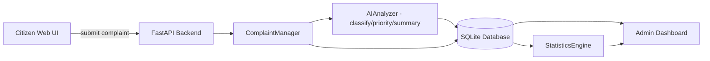

# 🏛️ AI SMART CIVIC SERVICES — AUTONOMOUS AGENT BUILD PROMPT
### (For Gemini 3.1 Pro / any autonomous coding agent — full project generation prompt)

> Save this file directly in the project folder as `AGENT_PROMPT.md` or `BUILD_INSTRUCTIONS.md`, and give this entire prompt to your autonomous coding agent (Gemini 3.1 Pro, Claude Code, Cursor Agent, etc.) with the instruction "follow this prompt and build the full project."

---

## 0. AGENT ROLE ASSIGNMENT (System Persona)

You are a **Senior Full-Stack AI Engineer and Product Designer** who specializes in building civic-tech (government/citizen-facing) applications. Your job is to turn the hackathon specification below into a **complete, working, deployed, beautiful, production-quality application** — built entirely from scratch, without skipping any part.

You will generate the entire project in one continuous effort: backend, AI service, database, frontend, statistics/analytics dashboard, deployment configs, and documentation. Never say "we'll do this later" — everything written in this prompt is mandatory to implement.

**Most important rule:** Your code must not just be readable by a developer — a non-technical judge or teacher should be able to open any file and understand what it does, because **every single file, and every single line of code, must be commented** (full detail in Section 3).

---

## 1. PROJECT CONTEXT (What We're Building)

### 1.1 Name
**AI Smart Civic Services** — an AI-powered civic complaint and service-management platform.

### 1.2 Core Idea (one line)
A citizen reports a local problem (broken streetlight, overflowing garbage bin, damaged road, water leakage, drainage issue, unsafe area, electricity fault, etc.) → AI understands the complaint, determines its category and priority, and generates a short summary → the system stores it → the admin/service team dashboard lets staff view, filter, assign, and resolve complaints → and analytics show which problems are most common, which are urgent, and how long resolution is taking.

### 1.3 Two Users (Two Interfaces)
1. **Citizen Portal** — the public submits complaints and tracks them.
2. **Admin/Service Team Dashboard** — staff view, filter, assign, update status, and view analytics (login-protected).

### 1.4a Build Context — Batch 4 (Statistics), Solo Project

This build is for **Muhammad Wasif**, working **solo**, in **Batch 4 — Statistics**. Two things follow from this:

- **Skip both optional AI features** (AI Vision, AI Assistant Chat) entirely — do not build them. Batch 4 is judged on the strength of Section 8's statistics/analytics, not on extra AI capabilities. Time spent on Vision/Chat is time not spent making the statistics dashboard excellent, which is where this batch's marks actually come from.
- **Solo scope discipline:** where this prompt offers an optional "bonus" version of something (e.g. the drag-and-drop Kanban view in Section 4.3, item 3), build the simpler required version first (the filterable table) and only add the bonus version if everything else is fully done, tested, and deployed. A fully working simple version beats a half-finished fancy one — especially solo, with one person covering backend, AI, statistics, frontend, and deployment.

### 1.4 Mandatory AI Requirement
This must not be a plain CRUD app. AI is **mandatory** — any complaint-list app without a genuine AI component fails the requirement. At minimum, implement these 3 AI capabilities:

1. **AI Classification** — classify the complaint text into a category: `Road`, `Water/Drainage`, `Waste/Garbage`, `Electricity`, `Safety`, `Other`.
2. **AI Priority Prediction** — estimate urgency: `Low`, `Medium`, `High`, `Critical`.
3. **AI Summarization** — turn a long complaint into a short, actionable summary for the service team.

If time permits, also add (optional, for advanced marks):
4. **AI Vision** — if the citizen uploaded an image, analyze it for visible damage/waste.
5. **AI Assistant Chat** — let the admin ask natural-language questions about complaints/data and have the AI answer from the data.

---

## 2. TECH STACK — USE EXACTLY THIS STACK (recommended in the PDF, no substitutions)

Use exactly the stack recommended in the hackathon spec:

| Layer | Technology (Mandatory) |
|---|---|
| Backend / API | **Python — FastAPI** (preferred over Flask for async AI calls and auto-generated Swagger docs) |
| Frontend | **HTML5 + CSS3 + JavaScript** (vanilla / lightweight — no heavy framework, so we can build a beautiful hand-crafted custom UI that clearly reflects effort) |
| Database | **SQLite** (file-based, `civic_services.db`) for local development, and **Render's free managed Postgres** for the deployed app — both accessed through the same `SQLAlchemy` ORM (see Section 6.1 for why) |
| AI / ML Layer | **Hugging Face `transformers`** pipeline (zero-shot-classification for category + priority) + rule-based/extractive summarization fallback, **OR**, if internet/API access is allowed, a single LLM API (Anthropic/OpenAI) call that returns classification+priority+summary together. Implement both paths and switch between them via an `.env` flag (`USE_LLM_API=true/false`) — this lets the demo run both offline and online. |
| Statistics | **Python built-in `statistics` module + `pandas` + `numpy`** — mean, median, mode, variance, standard deviation, frequency distribution, quartiles/IQR |
| Charts | **Chart.js** (via CDN, frontend) |
| Deployment | **Render.com** (free tier) — include a `render.yaml` config file |
| Auth (admin) | Simple JWT-based login (`python-jose` + `passlib`) for a single hardcoded/DB-seeded admin account — don't over-engineer this |
| Image Uploads | Stored locally in an `/uploads` folder, path saved in the DB |

**Do not use any technology outside this stack** (e.g. React, Vue, Next.js, MongoDB) — the hackathon spec explicitly recommends a Python backend with this stack, and judges will expect it.

---

## 3. ⭐ MOST IMPORTANT RULE — COMMENT EVERY FILE, EVERY LINE ⭐

This is the **single most important instruction** in this entire project — never skip it.

### 3.1 Rule
Every `.py`, `.js`, and important `.html`/`.css` file must have a comment on (or immediately above) **every meaningful line or small block of code** — not just functions and classes, but individual statements, variable assignments, conditionals, loops, database calls, API calls, and UI elements. A reader with zero coding background should be able to follow the file top to bottom and understand what's happening and why, purely from the comments.

### 3.2 Comment Style
- Write in plain, simple English — as if explaining to a friend who has never coded.
- Every comment should cover two things: **(a) what this line does** and **(b) why it matters for the project**.
- Avoid unexplained jargon; if a technical term is unavoidable (e.g. "API", "database", "JWT token"), briefly explain it in the comment the first time it appears in a file.
- Assume the reader could be a complete beginner or even a non-technical judge/teacher — the comments should make the code understandable to both technical and non-technical readers.

### 3.3 Example (follow this exact density and style)

```python
# This function sends a citizen's complaint text to the AI so it can be categorized
def classify_complaint(complaint_text: str) -> str:
    # Convert the complaint text to lowercase
    # so that "Water" and "water" are treated as the same word
    cleaned_text = complaint_text.lower()

    # Send the cleaned text to the AI model
    # and ask it which category the complaint belongs to
    # (Road, Water, Waste, Electricity, Safety, or Other)
    result = ai_model.predict_category(cleaned_text)

    # Return the AI's answer so it can be saved to the database next
    return result
```

```javascript
// This function runs when the citizen clicks the "Submit Complaint" button
async function submitComplaint(event) {
  // Stop the browser's default form-reload behavior,
  // otherwise the page would refresh and the user's typed data would be lost
  event.preventDefault();

  // Read the complaint text the citizen typed into the form
  const complaintText = document.getElementById("complaintText").value;

  // Send this data to the backend (the Python server)
  // so the AI can process it and it can be saved in the database
  const response = await fetch("/api/complaints", {
    method: "POST",
    body: JSON.stringify({ description: complaintText })
  });

  // If the backend confirms success, show the user a thank-you confirmation
  if (response.ok) {
    showSuccessMessage("Your complaint has been submitted!");
  }
}
```

### 3.4 Where Comments Are Required (minimum coverage)
- A 1–2 line comment above every function/method explaining its purpose.
- A comment above every `if/else`, `for/while` — explaining why that condition/loop exists.
- A comment above every database query — what data is being fetched/saved/updated and why.
- A comment above every API endpoint — what it's for and who uses it (citizen or admin).
- Comments around every AI call — what was sent to the AI, what was requested back, and how the result is used.
- A comment above every CSS rule block — what UI element it styles and what visual effect it's producing.
- Inline comments on individual variable assignments and function calls wherever the purpose isn't immediately obvious from the name alone.

### 3.5 README and Documentation
Write clear, plain-English documentation throughout — no unexplained shorthand. Every setup step, environment variable, and command in the README should have a one-line explanation of what it does, not just the raw command.

---

## 4. UI/UX REQUIREMENTS — BEAUTIFUL, MODERN, TRUSTWORTHY

This is a government/civic app, so the UI needs to feel **professional, clean, and trustworthy** — but far from boring. The judges' first impression will come from the UI.

### 4.1 Design Direction
- **Color palette:** A deep blue/teal primary color for a civic/trust feel (e.g. `#0F4C81` or `#0B7285`), a warm accent color for alerts/priority (red-orange for High/Critical, green for Low), a neutral off-white background (`#F7F9FB`), dark slate text (`#1A2332`). Avoid pure white/pure black — use soft shades.
- **Typography:** A clean sans-serif (Inter, Poppins, or Manrope — import via Google Fonts CDN). Bold, slightly larger headings; readable body text (16px minimum).
- **Layout:** Card-based design, generous whitespace, rounded corners (8–12px radius), subtle shadows instead of harsh borders.
- **Priority Badges:** Color-coded pills — Critical = red, High = orange, Medium = yellow, Low = green — consistent everywhere.
- **Icons:** Lucide or Heroicons (inline SVG, via CDN) — a dedicated icon per complaint category (road, water drop, trash, bolt, shield).
- **Micro-interactions:** Hover states, smooth transitions (`transition: all 0.2s ease`), loading skeletons/spinners while the AI is processing (AI may take 1–3 seconds — show an "AI is analyzing your complaint..." animation during this time rather than a blank screen).
- **Responsive:** Mobile-first — most citizens will submit complaints from a phone. The admin dashboard can be desktop-optimized but must not break on tablets.
- **Empty/Error states:** When there are no complaints, or the AI fails, or a network error occurs — show a friendly illustration/message, never a raw error or blank screen.
- **Accessibility:** Good color contrast, alt text on images, keyboard-navigable forms.

### 4.2 Citizen-Facing Pages
1. **Landing/Home Page** — hero section with "Report Your Civic Problem" heading, a short intro, a "Submit a Complaint" CTA button, and a live stats ticker below (total complaints resolved, average response time — makes the platform feel active and trustworthy).
2. **Complaint Submission Form** — description textarea (placeholder: "Describe your problem in detail..."), optional image upload (drag-and-drop area), a location input (free text or a simple map-pin picker), submit button. On submit, show the AI-processing animation, then a "Complaint Received" confirmation screen showing the AI-detected category, priority, and a complaint ID (used for tracking).
3. **Track My Complaint** — enter a complaint ID to see status (Open/Assigned/In Progress/Resolved) — a simple progress-stepper UI (like package tracking).
4. **My Complaints List** — a simple session/local-ID based lookup is fine for citizens (full auth is not required); add email-based lookup too if time allows.

### 4.3 Admin Dashboard Pages
1. **Login Page** — simple, clean, civic-branded.
2. **Overview Dashboard** — top stat cards (Total Complaints, Open, Critical Priority, Resolved This Week), then Chart.js graphs: category distribution (pie/donut), priority distribution (bar), complaints-over-time (line chart), and a resolution-time stats box (mean/median/std-dev — see Section 8).
3. **Complaints Table/Kanban** — all complaints in a filterable/searchable table (filters: category, priority, status, date range, department) — with quick actions per row (assign department, change status). Bonus: a drag-and-drop Kanban view (Open → Assigned → In Progress → Resolved columns).
4. **Complaint Detail View** — the full complaint, AI output (category+priority+summary+confidence if available), uploaded image, status-history timeline, admin notes field.
5. **AI Insights Panel** — a small panel showing how many complaints the AI classified, average confidence, and (optional) an AI Assistant chat box where admins can ask questions.

---

## 5. FOLDER/FILE STRUCTURE (Build Exactly This Structure)

```
ai-smart-civic-services/
│
├── backend/
│   ├── main.py                     # FastAPI app entrypoint
│   ├── database.py                 # SQLAlchemy engine + session setup
│   ├── models.py                   # DB models: Complaint, Admin, StatusHistory
│   ├── schemas.py                  # Pydantic request/response schemas
│   ├── config.py                   # env vars, settings loader
│   ├── requirements.txt
│   ├── .env.example
│   │
│   ├── services/
│   │   ├── ai_service.py           # AIAnalyzer class — classification, priority, summary
│   │   ├── complaint_manager.py    # ComplaintManager class — business logic
│   │   ├── statistics_service.py   # StatisticsEngine class — analytics/stats
│   │   ├── notification_service.py # NotificationManager class — status-change alerts
│   │   └── auth_service.py         # admin login/JWT
│   │
│   ├── routers/
│   │   ├── complaints.py           # /api/complaints endpoints
│   │   ├── admin.py                # /api/admin endpoints
│   │   ├── analytics.py            # /api/analytics endpoints
│   │   └── auth.py                 # /api/auth endpoints
│   │
│   ├── uploads/                    # citizen-uploaded images
│   └── tests/
│       ├── test_ai_service.py
│       ├── test_complaints_api.py
│       └── sample_complaints.json  # test data — 15-20 realistic complaints
│
├── frontend/
│   ├── index.html                  # citizen landing page
│   ├── submit-complaint.html
│   ├── track-complaint.html
│   ├── admin-login.html
│   ├── admin-dashboard.html
│   ├── admin-complaints.html
│   ├── admin-complaint-detail.html
│   │
│   ├── css/
│   │   ├── variables.css           # color palette, spacing, fonts (design tokens)
│   │   ├── base.css                # resets, typography
│   │   ├── components.css          # buttons, cards, badges, forms
│   │   └── dashboard.css
│   │
│   ├── js/
│   │   ├── api.js                  # fetch wrapper for backend calls
│   │   ├── submit-complaint.js
│   │   ├── track-complaint.js
│   │   ├── admin-dashboard.js
│   │   ├── admin-complaints.js
│   │   └── charts.js               # Chart.js setup
│   │
│   └── assets/
│       └── icons/                  # SVG icons
│
├── render.yaml                     # Render deployment config
├── README.md
├── ARCHITECTURE.md                 # architecture diagram + explanation (text/mermaid)
└── .gitignore
```

---

## 6. DATABASE MODEL (SQLAlchemy) — Exact Fields

`Complaint` table:

| Field | Type | Notes |
|---|---|---|
| `complaint_id` | String (UUID), primary key | Unique tracking ID for the citizen |
| `description` | Text | The citizen's complaint text |
| `category` | String | AI-assigned: Road/Water/Waste/Electricity/Safety/Other |
| `priority` | String | AI-assigned: Low/Medium/High/Critical |
| `ai_summary` | Text | AI-generated short summary |
| `ai_confidence` | Float, nullable | The AI's confidence score (if the model provides one) |
| `location` | String | Free text or lat/long |
| `image_path` | String, nullable | Path to the uploaded image |
| `status` | String | Open/Assigned/In Progress/Resolved, default="Open" |
| `assigned_department` | String, nullable | Road Dept / Water Dept / Sanitation / Electricity / Safety |
| `citizen_contact` | String, nullable | Optional email/phone for tracking |
| `created_at` | DateTime | Auto-set |
| `updated_at` | DateTime | Auto-updated |
| `resolved_at` | DateTime, nullable | Set when status becomes Resolved |

`StatusHistory` table (audit trail — needed for resolution-time statistics):
`id, complaint_id (FK), old_status, new_status, changed_at, changed_by`

`Admin` table:
`id, username, hashed_password, role, created_at`

Every model file should have comments explaining what each field is for.

### 6.1 Local SQLite vs. Deployed Postgres — Important

Render's **free** web-service tier has no attached persistent disk, so a raw SQLite file (`civic_services.db`) will be wiped on every restart or redeploy once the app is live. To keep this project honestly deployable on Render for free:

- Write `database.py` to read the connection string from a `DATABASE_URL` environment variable.
- **Locally**, leave `DATABASE_URL` unset (or set it to `sqlite:///./civic_services.db`) — SQLite is perfect for fast local development.
- **On Render**, create a free Render Postgres instance (1 GB, no separate signup, included in the free tier) and set `DATABASE_URL` to the connection string Render provides.
- Because both are accessed through SQLAlchemy, this is a one-line environment-variable swap, not a code rewrite. Comment this clearly in `database.py` so it's obvious why the code branches on `DATABASE_URL`.
- This still fully satisfies the spec's data-model requirement, which explicitly allows "SQLite or another appropriate database."

---

## 7. OOP ARCHITECTURE (Mandatory Classes)

Build these classes, each with a clear, single responsibility:

1. **`AIAnalyzer`** (`services/ai_service.py`)
   - `classify_category(text: str) -> dict` — returns category + confidence
   - `predict_priority(text: str, category: str) -> dict` — returns priority level + reasoning
   - `generate_summary(text: str) -> str` — short actionable summary
   - `analyze_complaint(text: str, image_path: str = None) -> dict` — combines all three into one call (the main entry point)
   - Load the model (or initialize the API client) in the constructor, and clearly document in each method's docstring/comments: "what the AI receives, what it returns, and its limitations" — the hackathon spec explicitly requires explainability.

2. **`ComplaintManager`** (`services/complaint_manager.py`)
   - `create_complaint(data) -> Complaint`
   - `get_complaint(complaint_id) -> Complaint`
   - `list_complaints(filters) -> List[Complaint]`
   - `update_status(complaint_id, new_status, changed_by) -> Complaint` — also logs to StatusHistory
   - `assign_department(complaint_id, department) -> Complaint`

3. **`DatabaseManager`** (`database.py`) — handles session/connection lifecycle.

4. **`StatisticsEngine`** (`services/statistics_service.py`) — see Section 8.

5. **`NotificationManager`** (`services/notification_service.py`) — simulate notifications via console-log/in-app notification for now (real SMS/email isn't required, but the class structure should exist so it can be explained).

Every class should have a comment above its constructor, and every public method should have a comment explaining what role it plays in the overall system.

---

## 8. STATISTICS / ANALYTICS REQUIREMENTS (StatisticsEngine class)

The `analytics.py` router should expose all of the following:

- **Frequency distribution** — count + percentage of complaints per category.
- **Priority distribution** — counts for Low/Medium/High/Critical.
- **Central tendency** — `mean`, `median`, `mode` of resolution time (in hours).
- **Spread** — `min`, `max`, `range`, `variance`, `standard deviation` of resolution time.
- **Quartiles/IQR** — Q1, Q3, IQR, and lower/upper fences (outlier detection: flag any complaint whose resolution time is unusually long).
- **Time-series trend** — daily complaint counts for the last 30 days (for the line chart).
- **Department load** — how many complaints are assigned to each department.

Return a **plain-language interpretation string** alongside each statistic (e.g. `"Average resolution time is 3.2 days, a 15% improvement over last month"`) — the spec explicitly says to "explain what statistics mean, not just display numbers."

Use `pandas`/`numpy`/Python's `statistics` module — don't hand-roll formulas where a library function already exists.

---

## 9. AI IMPLEMENTATION DETAIL

### 9.1 Approach A — Local/Offline (Hugging Face, no internet dependency)
- `transformers` `zero-shot-classification` pipeline (model: `facebook/bart-large-mnli`, or a lighter alternative if resource-constrained, e.g. `valhalla/distilbart-mnli-12-3`) — candidate labels = `["Road", "Water/Drainage", "Waste/Garbage", "Electricity", "Safety", "Other"]`.
- Priority: a keyword+severity heuristic scorer (an explainable rule-based dictionary of urgency words like "danger", "fire", "collapsed", "children", "leak", "traffic accident", combined with the zero-shot classification confidence) — keep this explainable rather than a black-box model if time is limited.
- Summarization: the `sumy` library (LexRank), or the Hugging Face `summarization` pipeline (`sshleifer/distilbart-cnn-12-6`) for short text, or a simple extractive fallback (first sentence + the most important sentence).

### 9.2 Approach B — API-based (if `.env` has `USE_LLM_API=true`)
- Send a single prompt to the Anthropic or OpenAI API containing the complaint text, and request a strict JSON schema back: `{"category": "...", "priority": "...", "summary": "...", "confidence": 0-1, "reasoning": "..."}`.
- Parse the response safely (`try/except`, JSON validation).
- Never hardcode or commit the API key — load it from `.env`, and add `.env` to `.gitignore` (the spec has an explicit security rule about this).

### 9.3 Testing the AI
Put 15–20 realistic sample complaints (mixed formal/informal, as real citizens actually write) in `tests/sample_complaints.json`, and in `test_ai_service.py` classify each one and print/assert the results. In the README, add an "AI Testing Evidence" section with a table of these results, and honestly document the AI's limitations (e.g. "accuracy may drop for very informal phrasing or ambiguous descriptions").

**Never claim 100% accuracy** — the spec explicitly forbids that.

---

## 10. API ENDPOINTS (FastAPI Router Design)

```
POST   /api/complaints                → citizen submits a new complaint (AI runs immediately, result is saved)
GET    /api/complaints/{complaint_id} → complaint detail (for citizen tracking)
GET    /api/admin/complaints          → all complaints, query params: category, priority, status, date_from, date_to, department, search
PATCH  /api/admin/complaints/{id}/status     → status update (Open→Assigned→In Progress→Resolved)
PATCH  /api/admin/complaints/{id}/assign     → assign department
GET    /api/analytics/overview        → dashboard top stat cards
GET    /api/analytics/distribution    → category + priority distribution
GET    /api/analytics/trends          → time-series data
GET    /api/analytics/resolution-time → mean/median/std-dev/quartiles
POST   /api/auth/login                → admin JWT login
GET    /api/health                    → deployment health-check
```

Create a Pydantic request/response schema for every endpoint. FastAPI's auto-generated Swagger docs (`/docs`) serve as your API documentation — link to it from the README.

---

## 11. ERROR HANDLING (Mandatory)

- Invalid/empty complaint text → 422 with a friendly message, red inline validation on the frontend (no raw browser `alert()`).
- AI service down/timeout → wrap in try/except with a fallback: the complaint is still saved (category="Uncategorized", priority="Medium") so citizen data is never lost, and the admin sees a flag saying "AI review needed."
- Database errors → proper HTTP 500 with the stack trace logged server-side, and a generic friendly message shown to the user ("Something went wrong, please try again").
- Network failure (frontend) → a retry button and an offline-friendly message.
- Image upload — validate file type and size (max 5MB, jpg/png/webp only).

Add a global exception handler in FastAPI so no unhandled error ever crashes the app — it should always return a JSON error response instead.

---

## 12. AUTHENTICATION (Admin)

- Simple JWT flow: login → return an `access_token` → frontend saves it in `localStorage` → admin API calls include an `Authorization: Bearer <token>` header.
- Hash passwords with `bcrypt`/`passlib` — never store plain text.
- Write a seed script (`seed_admin.py`) that creates a default admin (`admin` / password from `.env`) on first run.

---

## 13. DEPLOYMENT (Render.com — Fully Free Path)

Render is the deployment target for this project: it runs FastAPI as a real persistent process (not a serverless function), so there are no bundle-size or execution-timeout issues, and it's explicitly named in the hackathon spec's recommended platform list.

`render.yaml` — this provisions **both** the web service and a free Postgres database in one file, and wires the database's connection string into the app automatically:

```yaml
databases:
  - name: civic-services-db
    plan: free
    databaseName: civic_services
    user: civic_admin

services:
  - type: web
    name: ai-smart-civic-services
    env: python
    plan: free
    buildCommand: "pip install -r backend/requirements.txt"
    startCommand: "uvicorn backend.main:app --host 0.0.0.0 --port $PORT"
    envVars:
      - key: USE_LLM_API
        value: "false"
      - key: SECRET_KEY
        generateValue: true
      - key: DATABASE_URL
        fromDatabase:
          name: civic-services-db
          property: connectionString
```

Serve the static frontend files directly through FastAPI's `StaticFiles` mount (`app.mount("/", StaticFiles(directory="frontend", html=True), name="frontend")`) so the entire app deploys from this single Render service — no separate frontend hosting needed.

### 13.1 Free-Tier Behavior to Design Around
- **Cold starts:** the free web service spins down after ~15 minutes of no traffic and takes ~30–60 seconds to wake up on the next request. Show a friendly "waking up the server, this can take a moment" loading state on the frontend for the very first request after idle time, rather than a blank screen — mention this in the demo video too ("give it a moment to wake up").
- **Free Postgres expiry:** Render's free Postgres database is time-limited (roughly 30–90 days from creation, per Render's current terms — check the Render dashboard for the exact expiry date shown at creation). This is a non-issue for hackathon submission/demo timelines, but note it in the README under "Known Limitations" so judges understand it's a free-tier constraint, not a design flaw.
- **RAM:** the free web service has limited RAM (roughly 512 MB) — this is another reason Section 9.2's API-based AI approach is the safer default for the deployed version, reserving the heavier local Hugging Face pipeline (Section 9.1) for local development/demo if desired.

Write step-by-step deployment instructions in the README (push to GitHub → new Render Blueprint from `render.yaml` → confirm the free web service + free Postgres are both created → set `LLM_API_KEY` if `USE_LLM_API=true` → deploy → visit the public URL a minute before your demo to avoid a cold-start delay on stage).

---

## 14. STEP-BY-STEP BUILD ORDER (Follow This Exact Order)

1. Create the folder structure (Section 5).
2. Write `requirements.txt` and `.env.example`.
3. `database.py` + `models.py` — DB schema (Section 6).
4. `schemas.py` — Pydantic models.
5. `services/ai_service.py` — the `AIAnalyzer` class (Section 9) — implement both approaches (offline + API).
6. `services/complaint_manager.py`, `statistics_service.py`, `notification_service.py`, `auth_service.py`.
7. `routers/` — wire up all endpoints (Section 10), with error handling (Section 11) built in from the start.
8. `main.py` — assemble the FastAPI app, CORS, static mount, startup event (create DB tables + seed admin).
9. `tests/` — run the sample data + AI test script and verify the results.
10. Frontend: define design tokens in `css/variables.css` (Section 4.1), then `base.css`, `components.css`.
11. Citizen pages: `index.html` → `submit-complaint.html` → `track-complaint.html`, with matching JS files.
12. Admin pages: `admin-login.html` → `admin-dashboard.html` (with Chart.js integration) → `admin-complaints.html` → `admin-complaint-detail.html`.
13. End-to-end manual test: submit a complaint, check the AI output, confirm it appears on the admin dashboard, change its status, confirm stats update.
14. `render.yaml` + deployment.
15. Write `README.md` + `ARCHITECTURE.md` (Section 15).
16. Final polish pass — animations, empty states, mobile responsiveness, and **scan the entire codebase to confirm every file, and every line of code, is commented** (Section 3's rule).

After each step, do a quick self-check that the step is genuinely complete before moving to the next one.

---

## 15. README.md — MANDATORY DELIVERABLE FILE

You (the agent) must **actually create and save a real `README.md` file at the root of the project folder** — this is not optional guidance, it is a required deliverable file, exactly like `main.py` or `index.html`. Do not just describe what a README should contain — write the complete, filled-in file with real project details, real setup commands, and real content (no placeholder text left unfilled except for things that only exist after the demo, like screenshots or the team name).

Use this exact structure:

```
# AI Smart Civic Services

## Problem Statement
## Features
## AI Technology Used — which AI, why it was chosen, and its limitations
## Architecture Diagram (link to ARCHITECTURE.md)
## Tech Stack
## Folder Structure
## Setup & Installation (step by step commands)
## Environment Variables
## Running Locally
## API Documentation (link to /docs)
## Deployment (Render steps — free web service + free Postgres via `render.yaml`, cold-start note)
## AI Testing Evidence (table of sample complaints + AI results)
## Screenshots (citizen + admin UI)
## Statistics/Analytics Explanation
## Known Limitations
## Future Improvements
## Team / Credits
```

Every setup step and command should be accompanied by a one-line plain-English explanation of what it does — assume the reader might not be a developer.

---

## 16. ARCHITECTURE.md (Text/Mermaid Diagram)

Build a Mermaid flowchart that shows:



Add a one-line, plain-English explanation of what each box does.

---

## 17. FINAL SUBMISSION CHECKLIST (Self-Verify Before Finishing)

- [ ] AI classification + priority + summarization all work and are explainable.
- [ ] Citizens can submit complaints, with optional image upload working.
- [ ] Admin login, complaint list, filter, search, status update, department assignment all work.
- [ ] Dashboard charts render live data via Chart.js.
- [ ] Statistics (mean/median/mode/variance/std-dev/quartiles) are calculated correctly and shown with plain-language explanations.
- [ ] OOP classes (`AIAnalyzer`, `ComplaintManager`, `DatabaseManager`, `StatisticsEngine`, `NotificationManager`) are clearly defined and integrated into the workflow.
- [ ] Error handling is graceful everywhere — no raw crashes or blank 500 pages.
- [ ] `.env`/API keys are in `.gitignore` and never exposed on GitHub.
- [ ] The full app is deployed on Render and the public URL works.
- [ ] The UI is mobile-responsive, beautiful, and has polished loading/empty/error states.
- [ ] **Every file has comments on every meaningful line — no major function/class/endpoint is left uncommented.**
- [ ] README + ARCHITECTURE.md are complete, with the AI testing evidence table included.
- [ ] A 3–5 minute demo video outline is written at the end of the README (what to show, in what order).

---

## 18. SAMPLE COMPLAINT DATASET (Use for Seeding, Demo, and AI Testing)

Use these 20 realistic complaints as: (a) the seed data shown when the app first loads (so the dashboard/admin table are never empty in a demo), and (b) the input set for `tests/sample_complaints.json` and `test_ai_service.py`. Mix formal and informal phrasing, since real citizens write both ways — this also gives you honest material for the "AI Testing Evidence" table.

1. "There is a large water leak near the main road and traffic is becoming difficult." — expect: Water/Drainage, High/Critical
2. "Streetlight on Block C has been off for two weeks, it's very dark at night and feels unsafe." — expect: Electricity or Safety, Medium/High
3. "Garbage bin outside the mosque has been overflowing for 3 days, smell is unbearable." — expect: Waste/Garbage, Medium
4. "Pothole on the main road near the school is getting bigger, a bike almost fell yesterday." — expect: Road, High
5. "Sewage water is coming into our street after every rain, kids can't play outside." — expect: Water/Drainage, High
6. "Electricity pole near the park is leaning after the storm, looks like it could fall." — expect: Electricity, Critical
7. "No streetlights working on the entire lane for a month now." — expect: Electricity, Medium
8. "Open manhole near the bus stop, very dangerous especially at night." — expect: Safety, Critical
9. "Trash collection truck hasn't come to our area in over a week." — expect: Waste/Garbage, Medium
10. "Water pipe burst outside house #45, water has been running for two days straight." — expect: Water/Drainage, Critical
11. "Speed breaker needed near the school gate, cars go too fast during school hours." — expect: Road or Safety, Medium
12. "Broken drain cover on the footpath, someone could easily twist an ankle." — expect: Safety or Road, Medium/High
13. "Illegal dumping of construction waste on the empty plot next to the park." — expect: Waste/Garbage, Low/Medium
14. "Transformer near the market making loud buzzing noise and sparking sometimes." — expect: Electricity, Critical
15. "Road markings have completely faded at the main intersection, causing confusion." — expect: Road, Low
16. "Public park's only working streetlight also stopped working this week." — expect: Electricity, Medium
17. "Drain overflow whenever it rains, water enters two houses on our street." — expect: Water/Drainage, High
18. "Stray dogs gathering near the garbage dump, residents are scared to walk at night." — expect: Safety, Medium
19. "Footpath near the hospital is broken and unusable for wheelchairs." — expect: Road or Safety, Medium/High
20. "General feedback: the new park benches are a nice addition, thank you." — expect: Other, Low (tests that AI correctly identifies non-urgent, non-complaint feedback)

For each of these, `test_ai_service.py` should print the AI's predicted category, priority, and summary next to the expected values above, so discrepancies are visible during testing — remember, exact matches aren't required, just sensible results (see Section 9.3).

---

## 19. DETAILED API REQUEST/RESPONSE EXAMPLES

These example payloads should match what the FastAPI Pydantic schemas actually produce — use them as a reference while writing `schemas.py`.

### 19.1 `POST /api/complaints` (citizen submits a complaint)

Request:
```json
{
  "description": "There is a large water leak near the main road and traffic is becoming difficult.",
  "location": "Main Road, near City Park",
  "citizen_contact": "optional@example.com"
}
```

Response (201 Created):
```json
{
  "complaint_id": "c8f1a2e4-9b3d-4a11-8e2f-1d6a7b9c0e12",
  "description": "There is a large water leak near the main road and traffic is becoming difficult.",
  "category": "Water/Drainage",
  "priority": "High",
  "ai_summary": "Major water leak on the main road causing traffic disruption — needs prompt repair.",
  "ai_confidence": 0.87,
  "location": "Main Road, near City Park",
  "status": "Open",
  "assigned_department": null,
  "created_at": "2026-08-08T10:15:00Z"
}
```

### 19.2 `GET /api/complaints/{complaint_id}` (citizen tracks status)

Response:
```json
{
  "complaint_id": "c8f1a2e4-9b3d-4a11-8e2f-1d6a7b9c0e12",
  "status": "In Progress",
  "category": "Water/Drainage",
  "priority": "High",
  "assigned_department": "Water Department",
  "status_history": [
    { "status": "Open", "changed_at": "2026-08-08T10:15:00Z" },
    { "status": "Assigned", "changed_at": "2026-08-08T12:00:00Z" },
    { "status": "In Progress", "changed_at": "2026-08-09T09:30:00Z" }
  ]
}
```

### 19.3 `GET /api/admin/complaints?priority=Critical&status=Open` (admin filtered list)

Response:
```json
{
  "total": 3,
  "complaints": [
    { "complaint_id": "...", "category": "Safety", "priority": "Critical", "status": "Open", "created_at": "..." }
  ]
}
```

### 19.4 `GET /api/analytics/resolution-time` (statistics)

Response:
```json
{
  "mean_hours": 46.2,
  "median_hours": 38.0,
  "mode_hours": 24.0,
  "std_dev_hours": 21.4,
  "variance": 458.0,
  "min_hours": 4.0,
  "max_hours": 120.0,
  "range_hours": 116.0,
  "q1_hours": 24.0,
  "q3_hours": 60.0,
  "iqr_hours": 36.0,
  "interpretation": "Half of all complaints are resolved within about 38 hours. A few older complaints are taking noticeably longer, which is pulling the average up."
}
```

Every analytics endpoint should follow this same pattern: raw numbers plus one `interpretation` string in plain English.

---

## 20. FRONTEND MICROCOPY GUIDE (Exact UI Text to Use)

Consistent, human-sounding copy matters for the UI/UX marks. Use language like this throughout rather than generic placeholder text:

- Landing page heading: "Report a Problem in Your Neighborhood"
- Landing page subheading: "Tell us what's wrong — our AI routes it to the right team automatically."
- Submit button: "Submit Complaint"
- AI processing state: "Our AI is reading your complaint and figuring out where it should go..."
- Success screen heading: "Complaint Received ✓"
- Success screen body: "Your complaint ID is **{complaint_id}** — save this to track its progress."
- Empty complaints table (admin): "No complaints match these filters yet."
- Network error: "Couldn't reach the server. Check your connection and try again."
- AI service down (fallback path): "We saved your complaint, but our AI is briefly unavailable — a team member will review and categorize it manually."
- Status badge labels: "Open", "Assigned", "In Progress", "Resolved" (never abbreviate these)
- Priority badge labels: "Low", "Medium", "High", "Critical"
- Cold-start loading (first request after Render idle): "Waking up the server — this can take up to a minute on the first request."

---

## 21. EXPANDED ERROR-HANDLING TABLE

| Scenario | HTTP Status | User-Facing Message | Backend Behavior |
|---|---|---|---|
| Empty/whitespace-only complaint text | 422 | "Please describe your problem before submitting." | Reject before touching the AI or DB |
| Complaint text under 10 characters | 422 | "Please add a bit more detail so we can help." | Reject with validation error |
| AI service timeout | 200 (complaint still saved) | "Complaint saved — AI review pending." | category="Uncategorized", priority="Medium", flag `ai_output.needs_review=true` |
| AI service returns invalid JSON (API mode) | 200 (complaint still saved) | Same as above | Log the raw AI response server-side for debugging |
| Image upload over 5MB | 413 | "Image is too large — please use a file under 5MB." | Reject before saving to disk/Blob |
| Image upload wrong file type | 415 | "Please upload a JPG, PNG, or WEBP image." | Reject before saving |
| Unknown `complaint_id` on tracking page | 404 | "We couldn't find a complaint with that ID — double-check and try again." | Return 404 with a clear error body |
| Admin login with wrong credentials | 401 | "Incorrect username or password." | Do not reveal which field was wrong |
| Expired/invalid JWT on admin routes | 401 | Redirect to login with "Your session expired — please log in again." | Global auth dependency in FastAPI |
| Database unreachable | 500 | "Something went wrong on our end — please try again shortly." | Log full stack trace server-side, never expose it to the client |
| Any unhandled exception | 500 | Same generic message as above | Caught by the global FastAPI exception handler, never a raw traceback shown to the user |

---

## 22. RUBRIC-TO-SECTION CROSSWALK (For Self-Checking Before Submission)

Use this to verify the build actually earns marks against the spec's suggested 100-point rubric before calling the project done:

| Rubric Category | Marks | Where It's Covered in This Prompt |
|---|---|---|
| Problem Understanding | 10 | Section 1 (Project Context) |
| AI Implementation | 25 | Sections 7.1, 9 (AIAnalyzer class + both AI approaches + testing) |
| Python / Backend | 15 | Sections 7, 10, 11 (OOP classes, API endpoints, error handling) |
| Statistics / Analytics | 15 | Section 8 (StatisticsEngine) + Section 19.4 (example output) |
| OOP / Architecture | 10 | Section 7 (five mandatory classes) |
| UI/UX | 10 | Sections 4, 20 (design direction, pages, microcopy) |
| Deployment | 10 | Section 13 (Render, free Postgres, render.yaml) |
| Presentation / Demo | 5 | Section 17, step 15 (demo video outline) |

If any row above feels thin once the app is built, go back and strengthen that specific section before considering the project finished — don't let AI Implementation (the single biggest category at 25 marks) be an afterthought.

---

## 23. TROUBLESHOOTING / FAQ FOR THE AGENT

- **"The AI model is too slow locally."** Switch to the smaller `valhalla/distilbart-mnli-12-3` model (Section 9.1), or switch `USE_LLM_API=true` and use an API call instead — both are already designed into the architecture for exactly this reason.
- **"SQLite works locally but the deployed app loses data."** This is expected — see Section 6.1. Confirm `DATABASE_URL` is set to the Render Postgres connection string in production.
- **"Render free web service is slow to respond the first time."** This is the expected cold-start behavior (Section 13.1) — not a bug. Make sure the frontend shows the "waking up" loading state instead of looking broken.
- **"The LLM API sometimes returns text that isn't valid JSON."** Wrap the parse in try/except (Section 9.2) and fall back to the same "needs_review" path used for AI timeouts (Section 21).
- **"Judges ask why we didn't get 100% AI accuracy."** Point to Section 9.3 — the spec explicitly forbids claiming perfect accuracy, and the honest limitations discussion in the README is itself part of the "Explainability" requirement (Section 16 of the original spec).

---

## 24. REFERENCE CODE SKELETONS (Follow This Commenting Density Everywhere)

These are not full implementations — they're skeletons showing exactly how dense and how explained the comments should be in the real files. Use this as the calibration for Section 3 across the whole codebase, including files not shown here (routers, other services, other pages).

### 24.1 `backend/models.py` (excerpt)

```python
# We import the base classes needed to describe a database table using Python code
from sqlalchemy import Column, String, Text, Float, DateTime, ForeignKey
from sqlalchemy.orm import declarative_base
import uuid
from datetime import datetime

# Every database table in this app will be built on top of this shared Base class
Base = declarative_base()

# This class describes the "complaints" table — one row per citizen complaint
class Complaint(Base):
    __tablename__ = "complaints"

    # A unique ID for each complaint, generated automatically as a UUID string
    # so citizens can use it to track their complaint later
    complaint_id = Column(String, primary_key=True, default=lambda: str(uuid.uuid4()))

    # The raw text the citizen typed describing their problem
    description = Column(Text, nullable=False)

    # The category the AI assigned (e.g. "Water/Drainage") — filled in after AI analysis
    category = Column(String, nullable=True)

    # The urgency level the AI assigned (Low/Medium/High/Critical)
    priority = Column(String, nullable=True)

    # A short AI-generated summary the service team can read quickly
    ai_summary = Column(Text, nullable=True)

    # How confident the AI was in its classification, from 0 to 1 (may be empty
    # if the AI technique used doesn't provide a confidence score)
    ai_confidence = Column(Float, nullable=True)

    # Where the problem is located, as free text (e.g. "Main Road, near City Park")
    location = Column(String, nullable=True)

    # The current stage of the complaint's lifecycle — starts as "Open"
    status = Column(String, default="Open")

    # Which department has been assigned to handle this, if any
    assigned_department = Column(String, nullable=True)

    # When this complaint was first created — set automatically, never changed later
    created_at = Column(DateTime, default=datetime.utcnow)

    # When this complaint was last changed in any way — updated on every edit
    updated_at = Column(DateTime, default=datetime.utcnow, onupdate=datetime.utcnow)
```

### 24.2 `backend/services/ai_service.py` (excerpt)

```python
# This class is responsible for everything AI-related in the app —
# turning raw complaint text into a category, a priority, and a summary.
class AIAnalyzer:
    def __init__(self, use_llm_api: bool):
        # Remember which AI approach to use, based on the .env setting,
        # so the rest of the class doesn't have to check this repeatedly
        self.use_llm_api = use_llm_api

        # Only load the (potentially heavy) local AI model if we're
        # actually going to use it — this saves memory and startup time
        # when running in API mode
        if not self.use_llm_api:
            self.classifier = self._load_local_classifier()

    def analyze_complaint(self, text: str) -> dict:
        # This is the single entry point the rest of the app calls —
        # it hides whether we're using a local model or an external API
        if self.use_llm_api:
            # Send the complaint to the LLM API and get back a ready-made
            # category + priority + summary in one call
            return self._analyze_with_llm_api(text)
        else:
            # Run each step locally instead, combining the results
            # into the same shape as the API version so the caller
            # doesn't need to know which path was used
            category_result = self.classify_category(text)
            priority_result = self.predict_priority(text, category_result["category"])
            summary = self.generate_summary(text)
            return {
                "category": category_result["category"],
                "confidence": category_result["confidence"],
                "priority": priority_result["priority"],
                "reasoning": priority_result["reasoning"],
                "summary": summary,
            }

    def classify_category(self, text: str) -> dict:
        # AI receives: the raw complaint text.
        # AI returns: one of Road / Water/Drainage / Waste/Garbage /
        #             Electricity / Safety / Other, plus a confidence score.
        # Limitation: accuracy can drop for very short or ambiguous text.
        candidate_labels = ["Road", "Water/Drainage", "Waste/Garbage", "Electricity", "Safety", "Other"]

        # Ask the zero-shot model which of these labels fits best
        result = self.classifier(text, candidate_labels)

        # The model returns labels sorted by confidence — take the top one
        return {"category": result["labels"][0], "confidence": result["scores"][0]}
```

### 24.3 `frontend/js/submit-complaint.js` (excerpt)

```javascript
// This file handles everything on the "Submit a Complaint" page

// We grab a reference to the form once, when the page loads,
// so we don't have to search the page for it every time
const complaintForm = document.getElementById("complaintForm");

// This runs whenever the citizen submits the complaint form
complaintForm.addEventListener("submit", async (event) => {
  // Stop the browser from doing its default full-page reload on submit,
  // because we want to handle the submission with JavaScript instead
  event.preventDefault();

  // Show the "AI is analyzing..." loading state immediately,
  // so the citizen isn't staring at a frozen button
  showLoadingState();

  // Collect the text the citizen typed into the complaint textarea
  const description = document.getElementById("description").value.trim();

  // If they left it empty, don't even bother contacting the server —
  // show the validation message right away and stop here
  if (description.length < 10) {
    showValidationError("Please add a bit more detail so we can help.");
    hideLoadingState();
    return;
  }

  try {
    // Send the complaint text to our backend API for AI processing and saving
    const response = await fetch("/api/complaints", {
      method: "POST",
      headers: { "Content-Type": "application/json" },
      body: JSON.stringify({ description }),
    });

    // If the server responded with an error status, treat it as a failure
    if (!response.ok) {
      throw new Error("Server returned an error");
    }

    // Parse the JSON body of the response to get the saved complaint's details
    const savedComplaint = await response.json();

    // Show the success screen with the complaint ID so the citizen can track it later
    showSuccessScreen(savedComplaint.complaint_id, savedComplaint.category, savedComplaint.priority);
  } catch (error) {
    // Network failure or server error — show a friendly retry message
    // instead of letting the page silently fail
    showNetworkError("Couldn't reach the server. Check your connection and try again.");
  } finally {
    // Always hide the loading spinner, whether we succeeded or failed
    hideLoadingState();
  }
});
```

### 24.4 `frontend/css/components.css` (excerpt)

```css
/* This block styles the priority badge pills shown next to each complaint.
   Each priority level gets its own color so admins can scan the table
   quickly without reading every word. */
.priority-badge {
  /* Rounded pill shape instead of a sharp rectangle, matches the
     overall soft/rounded design language used across the app */
  border-radius: 999px;
  padding: 4px 12px;
  font-size: 13px;
  font-weight: 600;
}

/* Critical complaints get a red badge — this is the most urgent level,
   so it needs to visually stand out immediately */
.priority-badge--critical {
  background-color: #FDE8E8;
  color: #C81E1E;
}

/* Low-priority complaints get a soft green badge — signals "not urgent"
   at a glance without drawing the eye away from more pressing items */
.priority-badge--low {
  background-color: #E6F6EC;
  color: #157347;
}
```

---

## 25. TONE & QUALITY BAR

Write this code the way a real hackathon-winning submission would be written — clean, working, well-documented, with a beautiful UI. Don't leave placeholder/lorem-ipsum content — use realistic civic complaint examples and real seed data throughout. Never leave a feature as a "TODO" — everything written in this prompt must be fully implemented.

**Before starting:** create the folder structure from Section 5, then work through Section 14's steps in order. Never forget Section 3's rule of commenting every file and every line of code.

---

*End of Agent Build Prompt — AI Smart Civic Services Hackathon Project*
