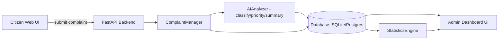

# Architecture: AI Smart Civic Services

This document provides a high-level overview of how data flows through the application.

## System Flowchart

## Component Explanations

- **Citizen Web UI:** The public-facing HTML/JS portal where citizens submit and track complaints.
- **FastAPI Backend:** The Python server that handles incoming requests, manages routing, and serves the frontend files.
- **ComplaintManager:** The business logic layer that handles saving complaints, updating statuses, and assigning departments.
- **AIAnalyzer:** The "brain" that intercepts incoming complaints and uses either local HuggingFace models or the Google Gemini API to assign a category, priority, and summary.
- **Database (SQLite/Postgres):** Stores complaints, audit logs (StatusHistory), and admin credentials. Uses SQLite locally for speed, and Render Postgres in production.
- **StatisticsEngine:** Uses Pandas and Numpy to crunch the data and generate the Batch 4 analytics (mean, median, standard deviation, quartiles) for the dashboard.
- **Admin Dashboard UI:** The private portal where city staff log in to view complaints, charts, and statistics.
